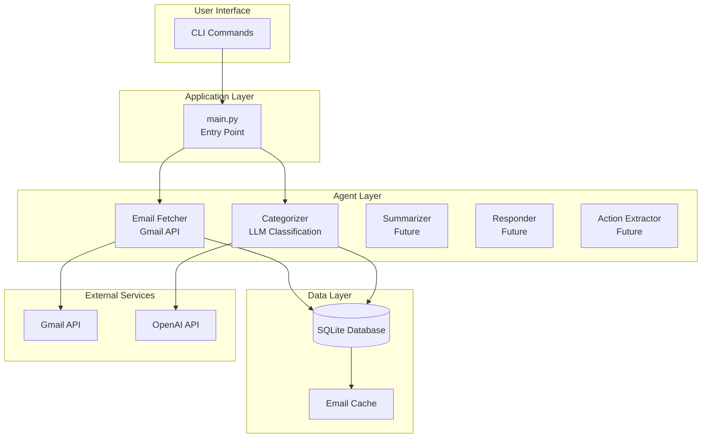
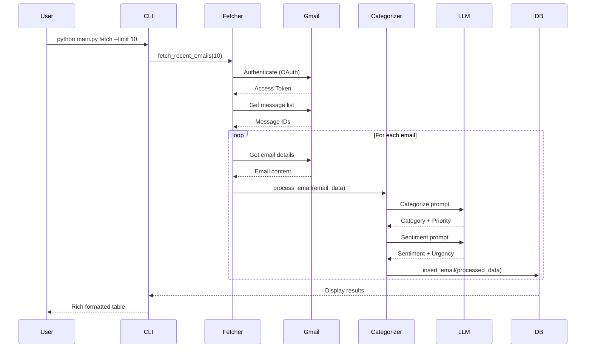

# Email Management Agent - Architecture Deep Dive

## 🏗️ System Overview

The Email Management Agent is a **multi-agent AI system** that processes emails through a pipeline of specialized components. It demonstrates key AI agent concepts including tool use, prompt engineering, state management, and external API integration.

---

## 📊 High-Level Architecture



---

## 🔄 Data Flow: Email Processing Pipeline



---

## 🧩 Component Breakdown

### 1. **Email Fetcher** (`agents/email_fetcher.py`)

**Purpose**: Interface with Gmail API to fetch and send emails

**Key Responsibilities**:
- OAuth2 authentication
- Fetch emails with search queries
- Parse email metadata and body
- Send emails

**Architecture Pattern**: **Adapter Pattern**
- Adapts Gmail API to our application's interface
- Handles authentication complexity
- Provides clean, simple methods

**Code Flow**:
```python
EmailFetcher()
  ├── authenticate()
  │   ├── Check for existing token
  │   ├── Refresh if expired
  │   └── OAuth flow if needed
  │
  ├── fetch_recent_emails(max_results, query)
  │   ├── Call Gmail API
  │   ├── Get message IDs
  │   └── For each ID:
  │       └── _get_email_details(id)
  │           ├── Fetch full message
  │           ├── Extract headers
  │           ├── Parse body
  │           └── Return structured data
  │
  └── send_email(to, subject, body)
      └── Format and send via Gmail API
```

**Key Learning**: How to integrate external APIs with OAuth authentication

---

### 2. **Email Categorizer** (`agents/categorizer.py`)

**Purpose**: Use LLM to classify and analyze emails

**Key Responsibilities**:
- Categorize emails (URGENT, WORK, PERSONAL, etc.)
- Assign priority scores (1-10)
- Analyze sentiment
- Detect urgency

**Architecture Pattern**: **Strategy Pattern**
- Different strategies for categorization vs sentiment
- Each uses LLM but with different prompts

**LangChain Integration**:
```python
from langchain_openai import ChatOpenAI

# Initialize LLM
self.llm = ChatOpenAI(
    model="gpt-4",
    temperature=0.3,  # Low temp for consistent classification
    api_key=settings.openai_api_key
)

# Invoke LLM
response = self.llm.invoke(prompt)
result = json.loads(response.content)
```

**Prompt Engineering Strategy**:
1. **Clear instructions**: Tell the model exactly what to do
2. **Structured output**: Request JSON for easy parsing
3. **Examples in prompt**: Show expected format
4. **Context limitation**: Truncate email body to 1000 chars

**Code Flow**:
```python
EmailCategorizer()
  ├── categorize(email_data)
  │   ├── Format CATEGORIZATION_PROMPT
  │   ├── Invoke LLM
  │   ├── Parse JSON response
  │   └── Return {category, priority, reasoning}
  │
  ├── analyze_sentiment(email_data)
  │   ├── Format SENTIMENT_PROMPT
  │   ├── Invoke LLM
  │   ├── Parse JSON response
  │   └── Return {sentiment, urgency, tone}
  │
  └── process_email(email_data)
      ├── Call categorize()
      ├── Call analyze_sentiment()
      └── Merge results into email_data
```

**Key Learning**: How to use LLMs for classification tasks with structured outputs

---

### 3. **Database Layer** (`utils/db.py`)

**Purpose**: Persist emails and agent results

**Key Responsibilities**:
- Store email metadata and content
- Cache categorization results
- Track action items
- Save draft responses

**Architecture Pattern**: **Repository Pattern**
- Abstracts database operations
- Provides clean interface for data access
- Easy to swap SQLite for PostgreSQL later

**Database Schema**:
```sql
-- Emails table
emails (
    id TEXT PRIMARY KEY,           -- Gmail message ID
    thread_id TEXT,                -- Conversation thread
    subject TEXT,
    sender TEXT,
    recipient TEXT,
    body TEXT,
    received_date TIMESTAMP,
    category TEXT,                 -- AI-generated
    priority INTEGER,              -- AI-generated (1-10)
    sentiment TEXT,                -- AI-generated
    urgency INTEGER,               -- AI-generated (1-10)
    summary TEXT,                  -- Future: AI-generated
    fetched_at TIMESTAMP
)

-- Actions table (Future)
actions (
    id INTEGER PRIMARY KEY,
    email_id TEXT,                 -- Foreign key
    description TEXT,
    deadline DATE,
    priority TEXT,
    people TEXT,                   -- JSON array
    completed BOOLEAN
)

-- Drafts table (Future)
drafts (
    id INTEGER PRIMARY KEY,
    email_id TEXT,                 -- Foreign key
    draft_content TEXT,
    sent BOOLEAN
)
```

**Key Methods**:
```python
EmailDatabase()
  ├── insert_email(email_data)
  ├── get_email(email_id)
  ├── get_emails_by_category(category)
  ├── get_recent_emails(limit)
  ├── insert_action(action_data)
  ├── get_pending_actions()
  └── save_draft(email_id, content)
```

**Key Learning**: How to design a database schema for AI agent state

---

### 4. **Prompt Templates** (`utils/prompts.py`)

**Purpose**: Centralize all LLM prompts

**Why Separate File?**
- Easy to iterate and improve prompts
- Version control for prompt changes
- Reusable across different agents
- Clear separation of concerns

**Prompt Structure**:
```python
CATEGORIZATION_PROMPT = """
[Role Definition]
You are an email categorization expert.

[Context]
Email Subject: {subject}
Email From: {sender}
Email Body: {body}

[Task]
Categorize this email into ONE of the following categories:
- URGENT: ...
- WORK: ...
[... more categories ...]

[Output Format]
Respond in JSON format:
{
    "category": "CATEGORY_NAME",
    "priority": 7,
    "reasoning": "Brief explanation"
}
"""
```

**Prompt Engineering Principles**:
1. **Role assignment**: "You are an expert..."
2. **Clear context**: Provide all relevant information
3. **Explicit instructions**: Step-by-step what to do
4. **Output format**: Specify exact format (JSON)
5. **Constraints**: Limit choices, set boundaries

**Key Learning**: How to structure effective prompts for different tasks

---

### 5. **Configuration** (`config/settings.py`)

**Purpose**: Centralized configuration management

**Architecture Pattern**: **Singleton Pattern**
- Single global settings instance
- Type-safe with Pydantic
- Loads from environment variables

**Key Features**:
```python
from pydantic_settings import BaseSettings

class Settings(BaseSettings):
    # Type-safe settings
    openai_api_key: str
    email_address: str
    max_emails_to_fetch: int = 50
    
    class Config:
        env_file = ".env"
        case_sensitive = False

# Global instance
settings = Settings()
```

**Benefits**:
- Type checking at runtime
- Automatic env var loading
- Default values
- Validation

**Key Learning**: How to manage configuration in Python applications

---

### 6. **CLI Interface** (`main.py`)

**Purpose**: User-facing command-line interface

**Architecture Pattern**: **Command Pattern**
- Each CLI command is a separate function
- Click handles argument parsing
- Rich provides beautiful output

**Commands**:
```python
@cli.command()
@click.option('--limit', default=10)
@click.option('--query', default='')
def fetch(limit: int, query: str):
    """Fetch and categorize recent emails."""
    # Implementation

@cli.command()
@click.option('--category')
@click.option('--limit', default=20)
def list_emails(category: str, limit: int):
    """List emails from database."""
    # Implementation

@cli.command()
def stats():
    """Show email statistics."""
    # Implementation
```

**Rich Integration**:
```python
from rich.console import Console
from rich.table import Table
from rich.panel import Panel

console = Console()

# Create beautiful tables
table = Table(title="Processed Emails")
table.add_column("Subject", style="cyan")
table.add_column("Category", style="green")
console.print(table)
```

**Key Learning**: How to build user-friendly CLI applications

---

## 🎯 Key Design Patterns Used

### 1. **Pipeline Pattern**
Emails flow through stages: Fetch → Categorize → Store → Display

### 2. **Adapter Pattern**
`EmailFetcher` adapts Gmail API to our interface

### 3. **Strategy Pattern**
Different LLM strategies for categorization vs sentiment

### 4. **Repository Pattern**
`EmailDatabase` abstracts data access

### 5. **Singleton Pattern**
Global `settings` instance

---

## 🔑 AI Agent Concepts Demonstrated

### 1. **Tool Use**
- Gmail API is a "tool" the agent uses
- LLM decides what category based on content
- Database is a "memory" tool

### 2. **Prompt Engineering**
- Structured prompts in `prompts.py`
- JSON output for parsing
- Role-based instructions

### 3. **State Management**
- SQLite stores processed emails
- Avoids re-processing same emails
- Builds knowledge over time

### 4. **Multi-Step Reasoning**
- Categorizer makes two LLM calls:
  1. Categorization
  2. Sentiment analysis
- Results are combined

### 5. **Error Handling**
```python
try:
    response = self.llm.invoke(prompt)
    result = json.loads(response.content)
except Exception as e:
    print(f"Error: {e}")
    return default_values
```

---

## 🚀 How It All Works Together

### Example: Fetching and Categorizing Emails

```python
# 1. User runs command
$ python main.py fetch --limit 5

# 2. CLI calls fetch() function
def fetch(limit: int, query: str):
    # 3. Initialize components
    fetcher = EmailFetcher()      # Handles Gmail
    categorizer = EmailCategorizer()  # Handles LLM
    db = EmailDatabase()          # Handles storage
    
    # 4. Fetch emails from Gmail
    emails = fetcher.fetch_recent_emails(max_results=limit)
    # → OAuth authentication
    # → API calls to Gmail
    # → Parse email content
    
    # 5. Process each email
    for email in emails:
        # 6. Categorize with LLM
        processed = categorizer.process_email(email)
        # → Format prompt with email content
        # → Call OpenAI API
        # → Parse JSON response
        # → Add category, priority, sentiment
        
        # 7. Store in database
        db.insert_email(processed)
        # → SQL INSERT
        
        # 8. Display in table
        table.add_row(...)
    
    # 9. Show results
    console.print(table)
```

---

## 🎓 What You're Learning

### Technical Skills
- ✅ **API Integration**: OAuth, REST APIs
- ✅ **LLM Usage**: Prompt engineering, structured outputs
- ✅ **Database Design**: Schema design, SQL operations
- ✅ **Python Patterns**: Classes, decorators, type hints
- ✅ **CLI Development**: Click, Rich, user experience

### AI Agent Concepts
- ✅ **Tool Use**: Agents using external tools (Gmail, DB)
- ✅ **Prompt Engineering**: Crafting effective prompts
- ✅ **State Management**: Persisting agent knowledge
- ✅ **Multi-Step Processing**: Chaining operations
- ✅ **Error Handling**: Graceful failures

### Software Architecture
- ✅ **Separation of Concerns**: Each file has one job
- ✅ **Design Patterns**: Adapter, Strategy, Repository
- ✅ **Configuration Management**: Environment variables
- ✅ **Code Organization**: Logical folder structure

---

## 🔮 Future Enhancements (Your Next Steps)

### 1. **Summarization Agent**
```python
class EmailSummarizer:
    def summarize_thread(self, thread_id):
        # Fetch all emails in thread
        # Use LLM to create summary
        # Extract key points and action items
```

### 2. **Response Drafter**
```python
class EmailResponder:
    def draft_response(self, email_id):
        # Get email context
        # Analyze tone and content
        # Generate appropriate response
        # Save as draft
```

### 3. **Action Extractor**
```python
class ActionExtractor:
    def extract_actions(self, email_id):
        # Parse email for tasks
        # Identify deadlines
        # Extract people mentioned
        # Store in actions table
```

### 4. **LangGraph Integration**
Build a state machine for complex workflows:
```python
from langgraph.graph import StateGraph

workflow = StateGraph()
workflow.add_node("fetch", fetch_emails)
workflow.add_node("categorize", categorize_emails)
workflow.add_node("summarize", summarize_emails)
workflow.add_edge("fetch", "categorize")
workflow.add_edge("categorize", "summarize")
```

---

## 📝 Key Takeaways

1. **Modular Design**: Each component has a single responsibility
2. **LLM as a Tool**: Use LLMs for specific tasks (classification, analysis)
3. **Prompt Engineering**: Well-crafted prompts are crucial
4. **State Persistence**: Database stores agent knowledge
5. **Error Handling**: Always handle API failures gracefully
6. **User Experience**: CLI should be intuitive and beautiful

---

## 🎯 Next Steps

Now that you understand the architecture, you can:

1. **Run the code** and see it in action
2. **Modify prompts** to improve categorization
3. **Add new agents** (summarizer, responder)
4. **Experiment with different LLMs** (GPT-3.5 vs GPT-4)
5. **Build the Streamlit UI** for visual interaction
6. **Move to Project 2** (Research Assistant with RAG)

Ready to dive deeper into any specific component? 🚀
